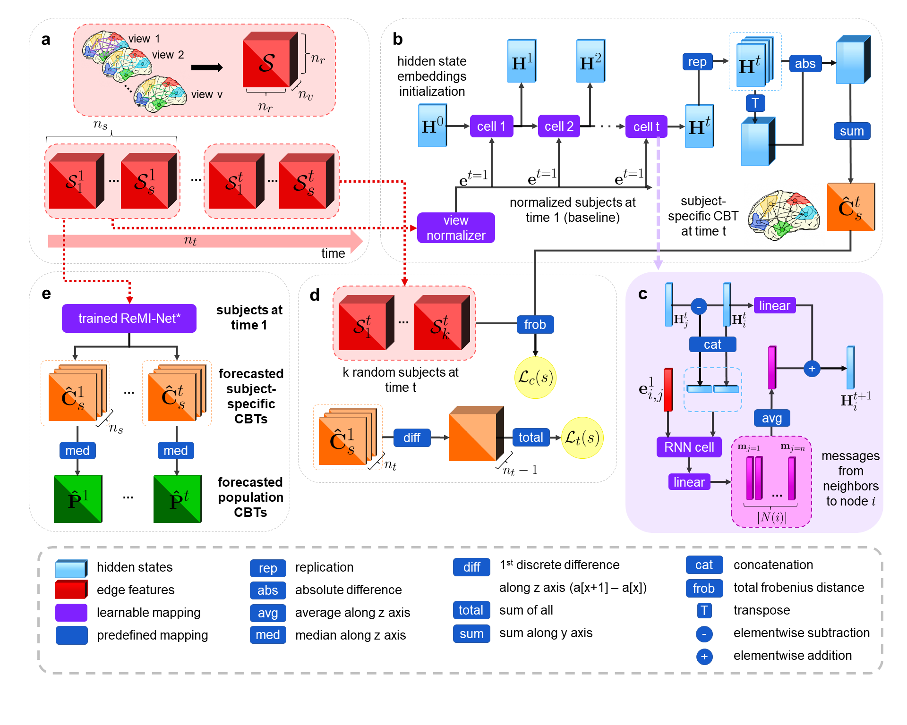

# ReMI-Net-Star
ReMI-Net-Star for jointly predicting connectional brain templates from a single brain graph, coded up in Python by Oytun Demirbilek. Please contact oytun1996@gmail.com for further inquiries. Thanks. 

This repository provides the official PyTorch implementation of the following paper:

> **Predicting the Evolution Trajectory of Population-Driven Connectional Brain Templates using Recurrent Multigraph Neural Networks**

> [Oytun Demirbilek](https://github.com/oytundemirbilek)<sup>1</sup>, [Islem Rekik](https://basira-lab.com/)<sup>1</sup>
> 
> <sup>1</sup>BASIRA Lab, Faculty of Computer and Informatics, Istanbul Technical University, Istanbul, Turkey
> 
>
> **Abstract:** The mapping of the the time-dependent evolution of the human brain connectivity using longitudinal and multimodal neuroimaging datasets provides insights into the development of neurological disorders and the way they alter the brain morphology, structure and function over time. Recently, the connectional brain template (CBT) was introduced as a compact representation integrating a population of brain multigraphs, where two brain regions can have multiple connections, into a single graph. Given a population of brain multigraphs observed at a baseline timepoint $t_1$,  we aim to learn how to predict the evolution of the population CBT at follow-up timepoints $t>t_1$. Such model will allow us to foresee the evolution of the connectivity patterns of healthy and disordered individuals \emph{at the population level}.  Here we present recurrent multigraph integrator network (ReMI-Net$^{\star}$) to forecast population templates at consecutive timepoints from a given single timepoint. In particular, we unprecedentedly design a graph neural network architecture to model the changes in the \emph{brain multigraph} and identify the biomarkers that differentiate between the typical and atypical populations. Addressing such issues is of paramount importance in diagnosing neurodegenerative disorders at early stages and promoting new clinical studies based on the pinned-down biomarker brain regions or connectivities. In this paper, we demonstrate the design and use of the ReMI-Net$^{\star}$ model, which learns both the multigraph node level and time level dependencies concurrently. Thanks to its novel graph convolutional design and normalization layers, ReMI-Net$^{\star}$ predicts well-centered, discriminative, and topologically sound connectional templates over time. Additionally, the results show that our model outperforms all benchmarks and state-of-the-art methods by comparing and discovering the atypical connectivity alterations over time. Our ReMI-Net$^{\star}$ code is available on GitHub at https://github.com/basiralab/ReMI-Net-Star

<p align="center">
  
</p>

This work is accepted for publication in MICCAI 2021, Strasbourg, France. ReMI-Net is a geometric deep learning framework for jointly predicting connectional brain templates. Using a predictive learning fashion, it preserves the topological structure of each target graph. We have evaluated our method on AD dataset from ADNI database. Detailed information can be found in the original paper and the video in the BASIRA Lab YouTube channel. In this repository, we release the code for training and testing ReMI-Net on a simulated dataset.

# Installation

The code has been tested with Python 3.8, PyTorch 1.10.0 on Ubuntu 20.04 and Windows. GPU is not required to run the code but it is recommended, it is tested on CUDA 10.2. You need to install PyTorch Geometric matching with your PyTorch version. You also need other dependencies (e.g., numpy, sklearn, scipy, matplotlib) which can be installed via: 

```bash
pip install numpy
pip install scipy
pip install sklearn
pip install matplotlib
pip install nxviz
```

# Training and testing ReMI-Net

We provide a demo code for the usage of ReMI-Net for connectional brain template forecasting from a baseline timepoint. In train.py we train ReMI-Net on a simulated dataset with 200 subjects and 6 timepoints. Each sample has 4 brain graphs (4 views or 4 edge features). In this example, we used three input arguments (i.e., recursion type, n_epochs and normalization type).

Note that we also provide a small simulation dataset and pretrained models trained with 25 epochs on the side for a demo, you can simulate a larger dataset and run a longer training.

First, you need to run a dataset simulation by typing:

```bash
python dataset.py
```

Then you can train a model with the following command:

```bash
python train.py
```

In this example, we simulated a training dataset with 200 samples and 6 timepoints and with 5-fold cross-validation. If you want to test the code using the hyperparameters described in the paper, type in the terminal the following command:

```bash
python test.py
```

# Input data

In order to use our framework, you need to have:

* a dataset represented by a 5-dimensional numpy array which shaped as: (#subjects, #timepoints, #ROIs, #ROIs, #views) .You need to include your data in the file train.py. So, just remove our simulated training and testing dataset and replace it with yours. Input of the model will take only the baseline timepoint t = 1 (i.e., shaped: (#subjects, 1, #ROIs, #ROIs, #views))

# Output Data

ReMI-Net output is a list of forecasted CBTs shaped as (#timepoints, #ROIs, #ROIs).


# YouTube videos to install and run the code and understand how ReMI-Net works

To install and run ReMI-Net-Star, check the following YouTube video:
https://www.youtube.com/watch?v=v6RKX86r2Fo&ab_channel=BASIRALab


To learn about how ReMI-Net-Star works, check the following YouTube video:
https://www.youtube.com/watch?v=2juy7Qk5WJc&ab_channel=BASIRALab

# Related references

```
@inproceedings{demirbilek2021recurrent,
  title={Recurrent Multigraph Integrator Network for Predicting the Evolution of Population-Driven Brain Connectivity Templates},
  author={Demirbilek, Oytun and Rekik, Islem},
  booktitle={International Conference on Medical Image Computing and Computer-Assisted Intervention},
  pages={584--594},
  year={2021},
  organization={Springer}
}
```

# Citation
```
@article{demirbilek2022predicting,
  title={Predicting the evolution trajectory of population-driven connectional brain templates using recurrent multigraph neural networks},
  author={Demirbilek, Oytun and Rekik, Islem and Alzheimer’s Disease Neuroimaging Initiative and others},
  journal={Medical Image Analysis},
  pages={102649},
  year={2022},
  publisher={Elsevier}
}
```


# Acknowledgement

This project has been funded by the 2232 International Fellowship for Outstanding Researchers Program of TUBITAK (Project No:118C288, http://basira-lab.com/reprime/) supporting Dr. Islem Rekik. However, all scientific contributions made in this project are owned and approved solely by the authors.

# License
Our code is released under MIT License (see LICENSE file for details).


